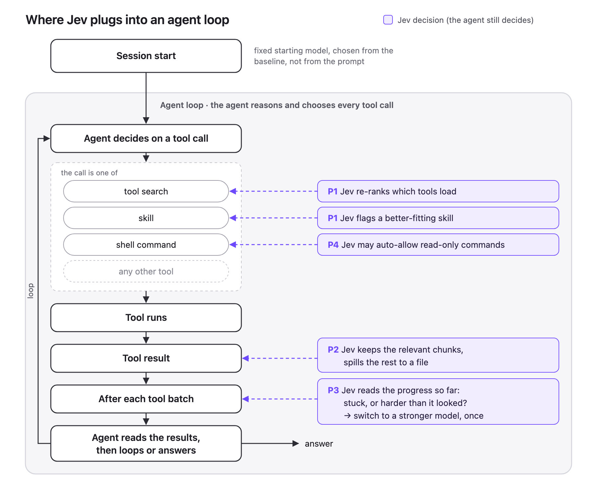

# Jev agent harness

This repository measures Jev decisions around a Claude Agent SDK loop. Claude still chooses and calls tools. Jev can rank deferred tools, trim large tool results, and choose a model before a session or subagent starts.



## Run the demo

```sh
npm install
npm run typecheck
npm test
BENCH_MODEL=haiku REPEATS=1 npm run bench
npm run report -- bench/results/<result>.jsonl
```

The benchmark includes four controls without Jev: `baseline`, `all-tools`, `tuned-search`, and `low-effort`. If `TYPESAFE_API_KEY` is set, it also includes shadow and live arms for tool search, trimming, and routing. Use `ARMS=baseline,jev-shadow` or `TASKS=tax,owner` to limit a run.

The report prints the token profile, the phase 1 stop/go gate, decision latency and answer distributions, routing results by predicted tier, paired confidence intervals, and the ship-rule verdict.

## Configure an app benchmark

Copy `bench/config.ts` to `bench/config.<app>.ts` and replace:

- the MCP servers and production system prompt;
- the strong, lookup, and specified-change models;
- `bench/tasks/demo.jsonl` with 50 to 100 tasks from logs;
- the optional `setup` handler, if each task must reset test-account state.

Each JSONL task has this shape:

```json
{"id":"invoice-tax","prompt":"Find the invoice tax region.","expectTools":["mcp__billing__get_tax_region"],"expectAnswer":{"regex":"REF-[0-9]+"},"setup":{"account":"test-acme"}}
```

`expectAnswer` may be a string, `{ "substring": "..." }`, or `{ "regex": "...", "flags": "i" }`. Add checks that need application logic through the second argument to `loadTasks()`.

Dump the connected MCP catalog before a run:

```sh
node bench/catalog.ts bench/config.<app>.ts bench/catalog.<app>.json
```

Replay baseline outputs through the trim policy without agent runs:

```sh
TYPESAFE_API_KEY=... BASELINE=baseline node bench/replay.ts bench/results/<result>.jsonl
```

The trimming hook targets outputs around 2,000 to 25,000 tokens by default. It keeps the final chunk, writes the full result to the configured spill directory in live mode, and returns the original output if Jev fails, times out, selects the escape choice, or cannot save enough text.
